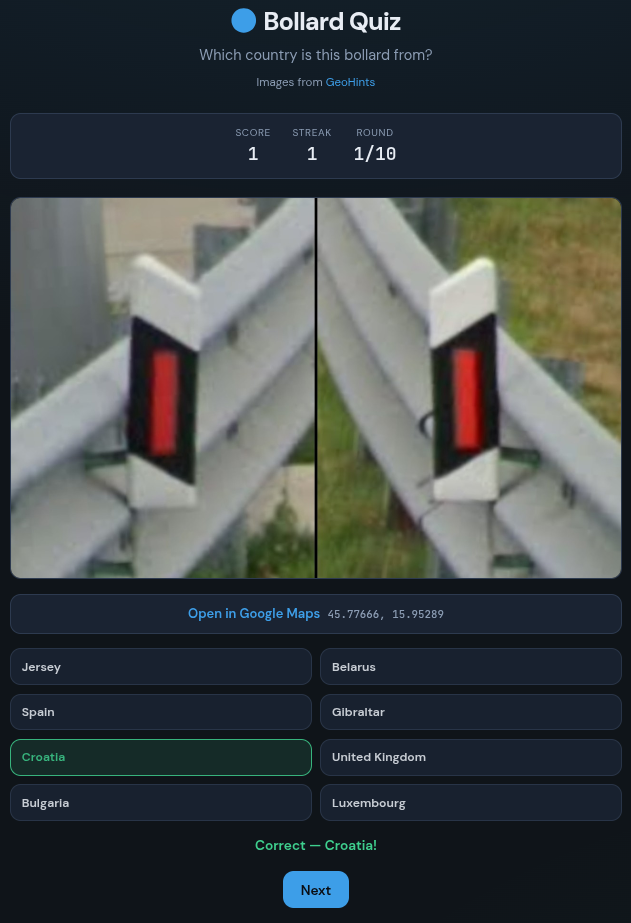

# Bollard Quiz

**Practice GeoGuessr-style country recognition using street bollards.**

A free, browser-based quiz built from the [GeoHints Bollards](https://geohints.com/meta/bollards) meta — over **900** Street View photos across **100+** countries. No account required; runs entirely in your browser.

## What is this?

In competitive [GeoGuessr](https://www.geoguessr.com/), **bollards** (those short posts at the roadside) are a popular meta: their shape, color, and reflectors often narrow down the country before you move. GeoHints maintains a community catalog of bollard photos with map locations — this game turns that dataset into a **multiple-choice trainer** so you can drill the meta offline or between ranked games.

Each round:

1. You see one bollard image from Google Street View.
2. You pick the country from several options.
3. You get instant feedback, score, and streak tracking.
4. After answering, **Open in Google Maps** appears in a reserved slot (no layout shift).

## Features

| Feature | Description |
|--------|-------------|
| **Answer mode** | Type the country name, or multiple choice (2 / 4 / 6 / 8 options) |
| **Distractors** | Worldwide, same continent first, or same continent only |
| **Question pool** | All bollards, or one random image per country |
| **Rounds** | 5, 10, 20, or endless |
| **Hints** | Optional continent label on the image |
| **Maps** | Open Street View location after each answer |
| **Settings** | Saved in your browser between sessions |

## Screenshot



## Run locally

Requires [Node.js](https://nodejs.org/) 20+ and [pnpm](https://pnpm.io/).

```bash
git clone https://github.com/<your-github-username>/bollard-game.git
cd bollard-game
pnpm install
pnpm dev
```

Open **http://localhost:5173**.

The dataset (`public/bollards.json`) is included in the repo so you can play without fetching. To refresh from GeoHints:

```bash
pnpm fetch-data        # ~1–2 min, resolves lat/lng from map links
pnpm fetch-data:fast   # map URLs only, no coordinate resolution
```

Production build:

```bash
pnpm build
pnpm preview
```

## Data & attribution

- **Images and country labels** © [GeoHints](https://geohints.com) — unofficial fan project, not affiliated with GeoHints or GeoGuessr.
- Bollard photos load from the GeoHints CDN at runtime.
- Map coordinates are derived from GeoHints’ “Open in Google Maps” short links (Street View positions).

## Project structure

```
bollard-game/
├── .github/workflows/deploy.yml   # GitHub Pages CI
├── docs/screenshot.png            # README preview image
├── public/bollards.json           # Quiz dataset
├── scripts/fetch-bollards.mjs     # Scraper / coordinate resolver
├── src/main.js                    # Game logic
├── src/style.css                  # Styles
└── index.html                     # App shell
```

## License

ISC — see [package.json](package.json). GeoHints content remains subject to GeoHints’ own terms; use respectfully and link back to their site when sharing this project.
